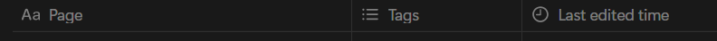

## Still in progress!

## How to start the application:
1. Clone the repository and install the required packages
npm clone https://github.com/Strange-14M605/Notion_DB_to_Personal_Blog.git
npm install

2. Create your notion database with the following columns:

3. Integrate
 A. Create a Notion API token (grant read access) at this link: https://www.notion.so/profile/integrations
 B. Go to your Notion database and add a connection (In the page dropdown > Connections> Search token name)
 C. Create a .env.local file in the root directory of your project. Add the following:
    NOTION_TOKEN=
    NOTION_DATABASE_ID= (this part of your database URL: https://www.notion.so/3fa29cde40918476be9a001b0c3de1f2?v=9aefbc2340814d12a7cb000cc81a77b1)

4. Start the application
npm run dev

To read more about the project and how to customise, read my blog:
https://jovarghese.vercel.app/blog/1e893be5-4084-80b9-acb6-ca1e98073d0a?title=Connecting%20your%20personal%20blogging%20website%20to%20a%20Notion%20database&date=05/05/2025

### Explore my work and projects
Visit **[jovarghese.vercel.app](https://jovarghese.vercel.app/)** to learn more about me, my skills, and the projects I’ve built.  

Stay curious, stay creative! ✨